# goit-rdb-fp

**#1**

```
CREATE SCHEMA pandemic;
USE pandemic;
```
* <strong>My solution</strong>: Import all columns with type TEXT, then replace the empty string with NULL, then set the required types

* <strong>Variant solution</strong>: Replace empty string with 'NULL' or 'null' in .csv file before import, then import table with chosen type in MySQL Workbench

<details>
  <summary>Screenshot</summary>

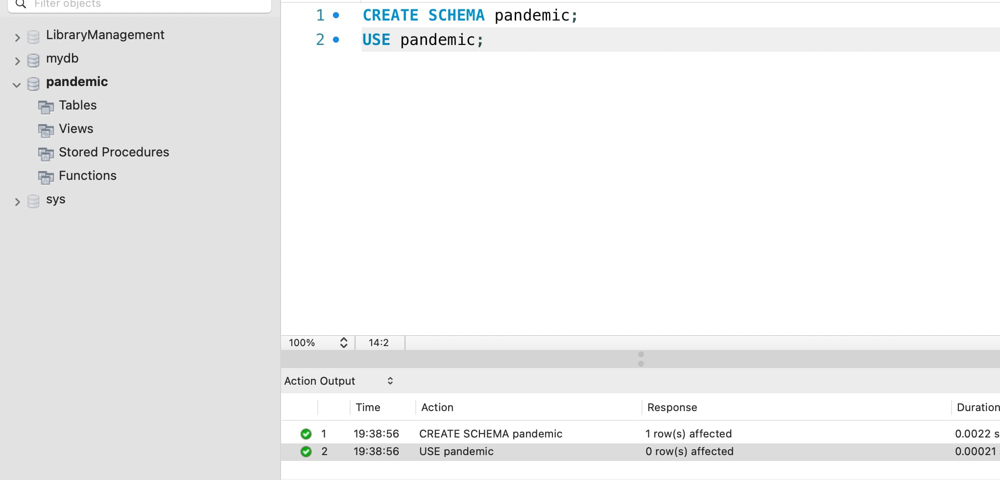
all cols as text
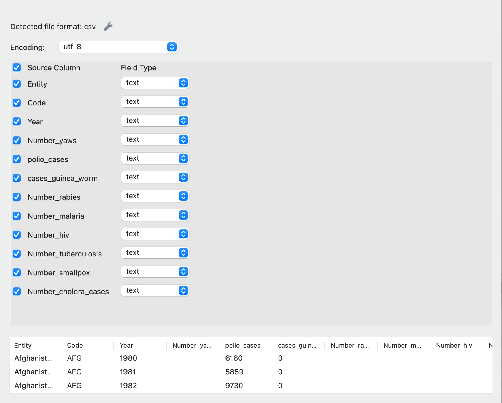
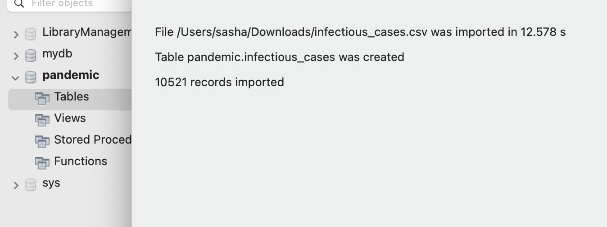
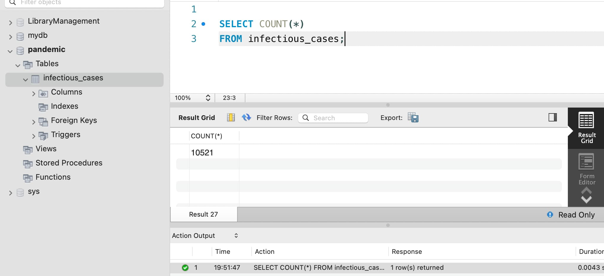

</details>

___

**#2**

```
-- add id:
ALTER TABLE infectious_cases
ADD COLUMN id INT NOT NULL AUTO_INCREMENT PRIMARY KEY;
```

<details>
  <summary>Screenshot</summary>

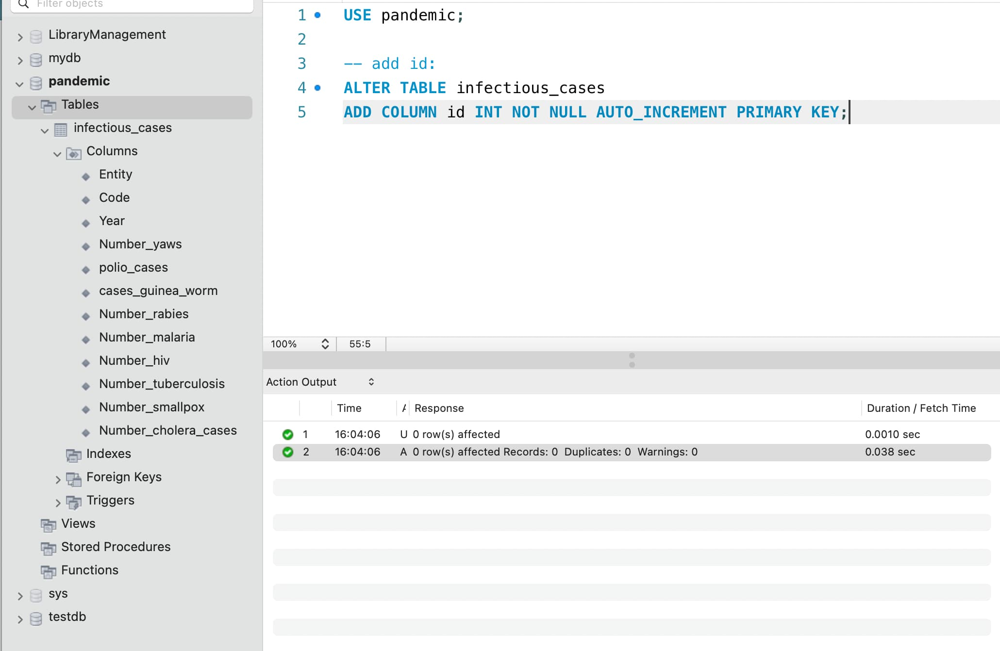

</details>

___

```
-- replace empty str with NULL:
SET SQL_SAFE_UPDATES = 0;

UPDATE infectious_cases
SET 
    Entity = NULLIF(Entity, ''),
    Code =  NULLIF(Code, ''),
    polio_cases = NULLIF(polio_cases, ''),
    Number_yaws = NULLIF(Number_yaws, ''),
    cases_guinea_worm = NULLIF(cases_guinea_worm, ''),
    Number_rabies = NULLIF(Number_rabies, ''),
    Number_malaria = NULLIF(Number_malaria, ''),
    Number_hiv = NULLIF(Number_hiv, ''),
    Number_tuberculosis = NULLIF(Number_tuberculosis, ''),
    Number_smallpox = NULLIF(Number_smallpox, ''),
    Number_cholera_cases = NULLIF(Number_cholera_cases, '');

SET SQL_SAFE_UPDATES = 1;
```

<details>
  <summary>Screenshot</summary>

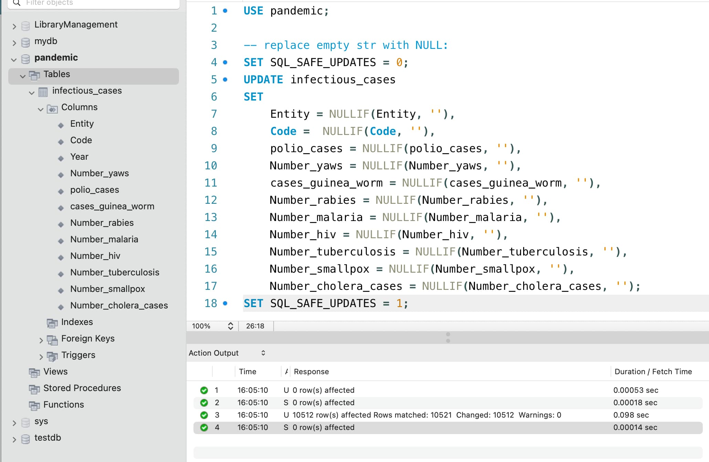

</details>

___

```
-- create entities table
CREATE TABLE entities (
    id INT NOT NULL AUTO_INCREMENT PRIMARY KEY,
    name VARCHAR(255) NOT NULL,
    code VARCHAR(255)
);
```

<details>
  <summary>Screenshot</summary>

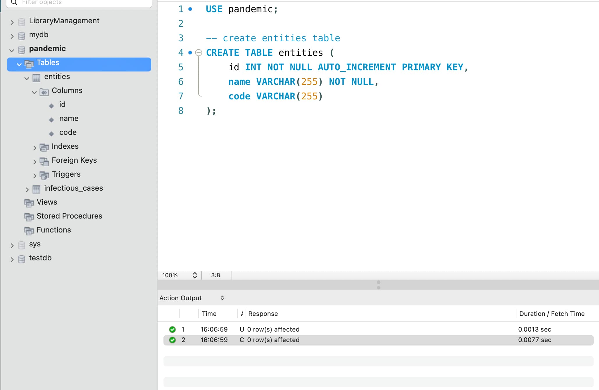

</details>

___

```
-- fill entities 
INSERT INTO entities (name, code)
SELECT DISTINCT Entity, Code 
FROM infectious_cases
WHERE Entity IS NOT NULL;
```

<details>
  <summary>Screenshot</summary>

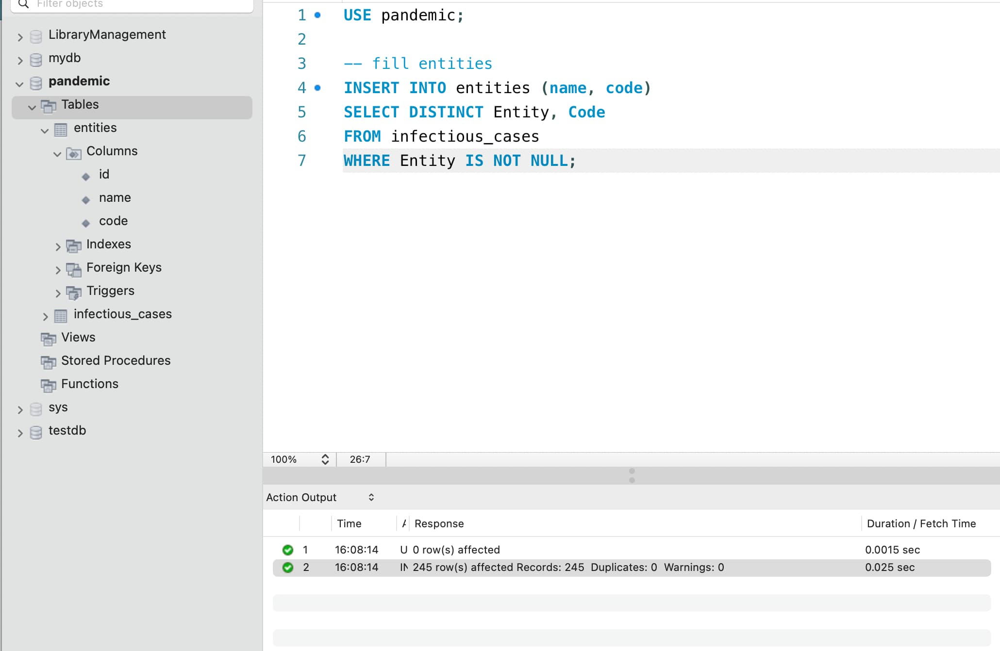

</details>

___

```
-- drop 'code' column
ALTER TABLE infectious_cases
DROP COLUMN Code;
```

<details>
  <summary>Screenshot</summary>


</details>

___

```
-- update entity by id
SET SQL_SAFE_UPDATES = 0;

UPDATE infectious_cases ic
JOIN entities e ON ic.Entity = e.name
SET ic.Entity = e.id;

SET SQL_SAFE_UPDATES = 1;
```

<details>
  <summary>Screenshot</summary>


</details>

___

```
-- rename column Entity -> entity_id
ALTER TABLE infectious_cases
RENAME COLUMN Entity TO entity_id;
```

<details>
  <summary>Screenshot</summary>

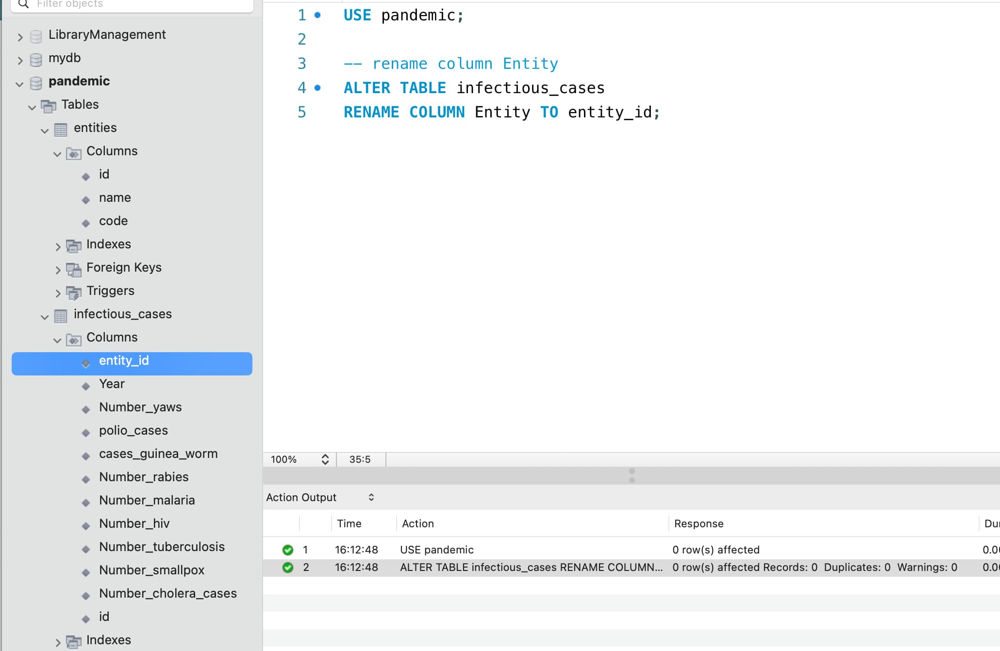

</details>

___

```
-- set columns types
ALTER TABLE infectious_cases
MODIFY COLUMN entity_id INT NOT NULL,
MODIFY COLUMN Year YEAR NOT NULL,
MODIFY COLUMN Number_yaws INT,
MODIFY COLUMN polio_cases INT,
MODIFY COLUMN cases_guinea_worm INT,
MODIFY COLUMN Number_rabies DOUBLE,
MODIFY COLUMN Number_malaria DOUBLE,
MODIFY COLUMN Number_hiv DOUBLE,
MODIFY COLUMN Number_tuberculosis DOUBLE,
MODIFY COLUMN Number_smallpox DOUBLE,
MODIFY COLUMN Number_cholera_cases INT;
```

<details>
  <summary>Screenshot</summary>

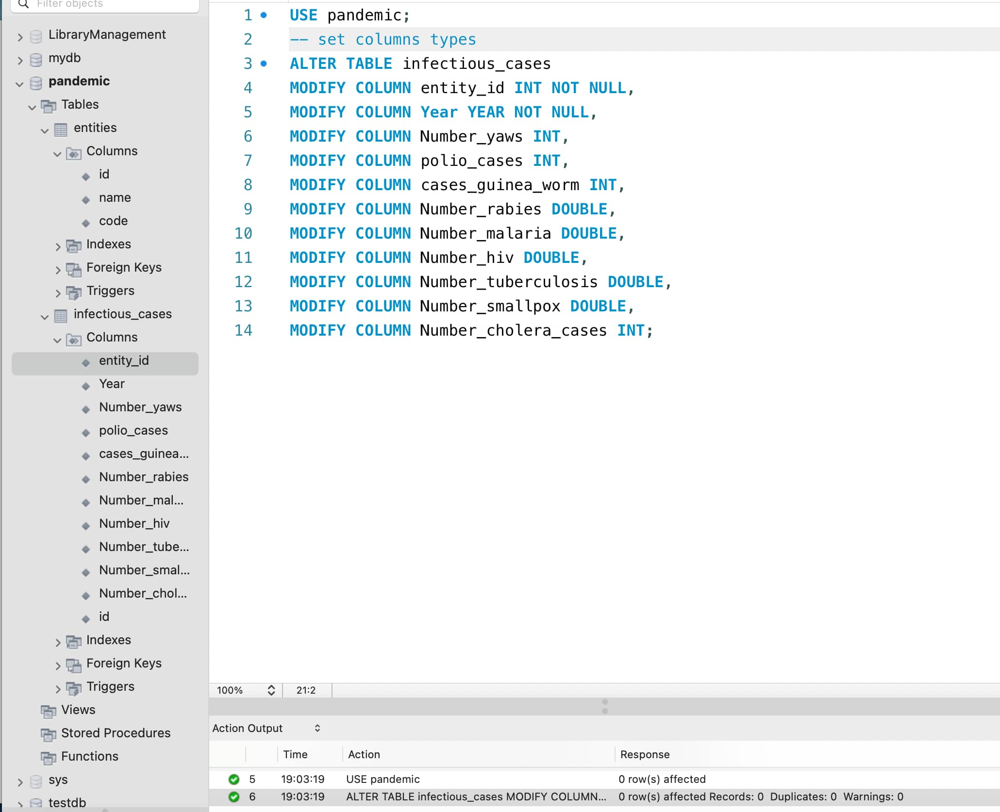

</details>

___

```
-- add foreign key
ALTER TABLE infectious_cases 
ADD CONSTRAINT fk_entity_id
FOREIGN KEY (entity_id) REFERENCES entities(id);
```

<details>
  <summary>Screenshot</summary>


</details>

___

```
-- create indexes 
CREATE INDEX idx_entity_id ON infectious_cases(entity_id);
CREATE INDEX idx_year ON infectious_cases(Year);
```

<details>
  <summary>Screenshot</summary>

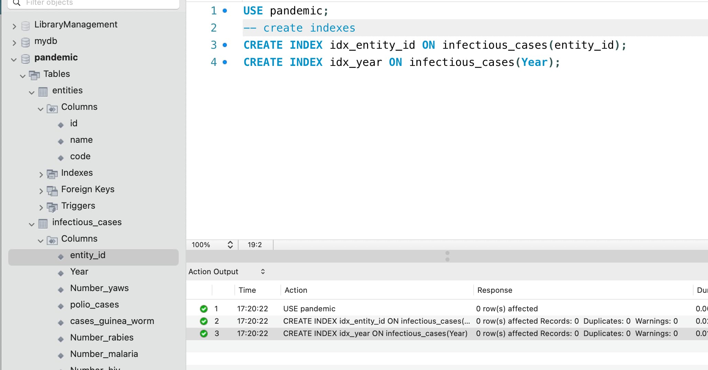

</details>

___

```
SHOW FULL COLUMNS FROM infectious_cases;
```

<details>
  <summary>Screenshot</summary>

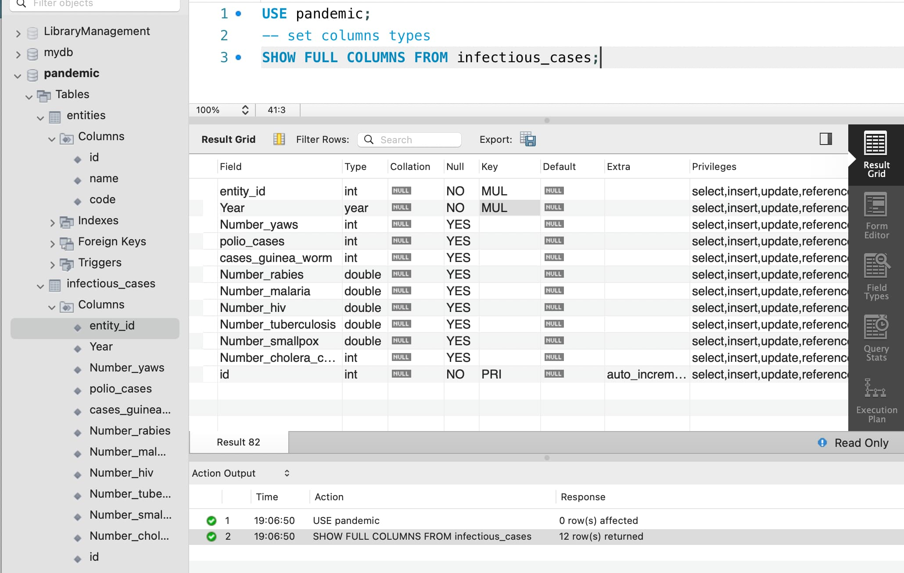

</details>

___

```
-- check has null entity_id or year
SELECT COUNT(id) 
FROM infectious_cases 
WHERE entity_id IS NULL
  OR Year IS NULL;
```

<details>
  <summary>Screenshot</summary>

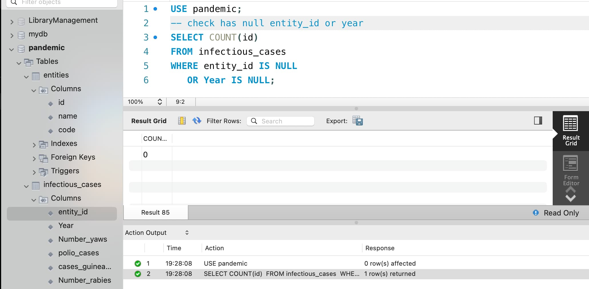

</details>

___

**#3**

```
SELECT e.name, e.code,
   AVG(ic.Number_rabies) AS avg_rabies,
   MIN(ic.Number_rabies) AS min_rabies,
   MAX(ic.Number_rabies) AS max_rabies,
   SUM(ic.Number_rabies) AS sum_rabies
FROM infectious_cases ic
INNER JOIN entities AS e ON e.id=ic.entity_id 
WHERE ic.Number_rabies IS NOT NULL
GROUP BY ic.entity_id
ORDER BY avg_rabies DESC
LIMIT 10;
```

<details>
  <summary>Screenshot</summary>


</details>

___

**#4**

```
-- CURDATE() or CURRENT_DATE
SELECT DISTINCT ic.year, 
	MAKEDATE(ic.year, 1) AS new_date, 
	CURRENT_DATE, 
	TIMESTAMPDIFF(YEAR, MAKEDATE(ic.year, 1), CURRENT_DATE) AS diff_year_1,
  YEAR(CURRENT_DATE) - ic.year AS diff_year_2
FROM infectious_cases ic;
```

<details>
  <summary>Screenshot</summary>

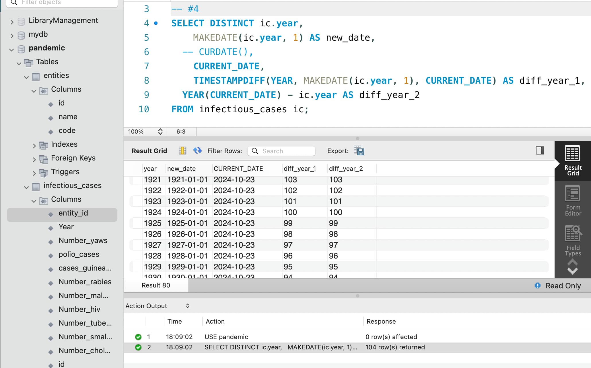

</details>

___

**#5**

```
-- declare
DROP FUNCTION IF EXISTS YearDiff;
DELIMITER //

CREATE FUNCTION YearDiff(y INT)
RETURNS INT
DETERMINISTIC 
NO SQL
BEGIN
  RETURN TIMESTAMPDIFF(YEAR, MAKEDATE(y, 1), CURRENT_DATE);
END //

DELIMITER ;

-- call YearDiff func
SELECT DISTINCT ic.year, 
  MAKEDATE(ic.year, 1) AS new_date, 
  CURRENT_DATE,
  YearDiff(ic.year) AS diff_year
FROM infectious_cases ic;
```

<details>
  <summary>Screenshot</summary>


</details>